Claim Prediction Challenge
================
Anil Nanayakkara
June 3, 2019

Executive Summary
-----------------

An important goal of insurance is to charge customers the appropriate amount for the risk that they represent. Given the random nature of motor vehicle accidents and the low prevalence of claims relative to claim free insured vehicles, it is a challenge to accurately predict which vehicles would have a claim in a given year. Vehicle characteristics were analyzed and used to predict to a certain degree of sensitivity and specificity by maximizing linear combinations of their effects. Primary component analysis (pca) enabled the prediction space to be split into different regions where either the pca or the logistic regression method preferred in order to produce an ensemble prediction. Impact of "Accident Forgiveness" policies were found not to be detrimental to assigning risk while "Claim Free" households significantly helped improve the specificity of predictions.

Introduction
------------

This report scrutinizes the culmination of data science skills employed to complete the "Choose Your Own Project" part of the "Data Science: Capstone" course which is the last of 9 courses in the Data Science Professional Certificate Program offered by HarvardX, an online learning initiative of Harvard University of Cambridge, Massachusetts. It describes the data set that was used to gain insights, observations made about the data, analysis of machine learning algorithms used and how they were optimized to best classify the data according to the needs of the insurance industry, predictions from the data and conclusions that could be made from the predictions and recommendations for further analysis. The scope of this project report is limited to the investigation of the ability to accurately classify customers vehicles as either having losses or not having losses in a given year. Although there is information regarding the loss amounts in the data set, this report only focuses on the classification of zero losses versus positive loss amounts. The driving methodology for optimizing the linear combinations of factors that contributes to an accurate prediction was primary component analysis (PCA). This methodology was pitted against logistic regression, which is considered the standard to beat in machine learning algorithms used for classification. Chi-Square tests, visualizations and confusion matrices were also used to bring together the impact of past loss history into the prediction algorithm as well.

The Data Set
------------

The data set that will be used for this project is the "AllState Claim Prediction Challenge" data set found at <https://www.kaggle.com/c/ClaimPredictionChallenge/data>. Specifically the data set "train\_set.zip" has been downloaded manually from this site and used in the project for training and validation purposes. There is also a "test\_set.zip" archive on the site, but it is not used in this project as there is no actual results provided to validate the accuracy of the prediction. Instead, a portion of the "train\_set.zip" data would be partitioned and used for validation.

The structure of the data sets can be observed by looking at the 2005 data set:

    ## Observations: 4,025,681
    ## Variables: 37
    ## $ X               <int> 1, 2, 3, 4, 5, 6, 7, 8, 9, 10, 11, 12, 13, 14,...
    ## $ Row_ID          <int> 1, 2, 3, 5, 9, 10, 12, 14, 16, 18, 20, 21, 22,...
    ## $ Household_ID    <int> 1, 2, 3, 3, 4, 5, 5, 5, 6, 6, 9, 9, 9, 9, 10, ...
    ## $ Vehicle         <int> 3, 2, 1, 2, 3, 1, 3, 4, 1, 2, 1, 3, 4, 5, 1, 2...
    ## $ Calendar_Year   <int> 2005, 2005, 2005, 2005, 2005, 2005, 2005, 2005...
    ## $ Model_Year      <int> 2005, 2003, 1998, 2001, 2002, 1995, 2003, 2004...
    ## $ Blind_Make      <fct> K, Q, AR, D, AQ, BW, BW, Y, BH, BW, BW, BW, BP...
    ## $ Blind_Model     <fct> K.78, Q.22, AR.41, D.20, AQ.17, BW.3, BW.167, ...
    ## $ Blind_Submodel  <fct> K.78.2, Q.22.3, AR.41.1, D.20.0, AQ.17.1, BW.3...
    ## $ Cat1            <fct> D, B, B, J, B, D, I, F, I, I, I, H, I, I, I, C...
    ## $ Cat2            <fct> C, C, ?, C, C, ?, C, C, ?, C, C, ?, A, C, A, ?...
    ## $ Cat3            <fct> F, A, A, B, B, E, F, A, A, F, B, A, B, F, A, A...
    ## $ Cat4            <fct> ?, A, A, ?, A, ?, ?, C, ?, ?, ?, ?, ?, ?, ?, B...
    ## $ Cat5            <fct> ?, A, A, ?, A, ?, ?, A, ?, ?, ?, ?, ?, ?, ?, A...
    ## $ Cat6            <fct> C, E, C, D, D, D, D, C, B, D, D, D, C, B, B, B...
    ## $ Cat7            <fct> ?, C, C, ?, C, ?, ?, ?, ?, ?, ?, ?, ?, ?, ?, ?...
    ## $ Cat8            <fct> C, A, A, A, B, A, B, B, A, B, B, B, A, C, A, A...
    ## $ Cat9            <fct> A, B, B, B, A, B, A, B, B, A, B, B, A, A, B, B...
    ## $ Cat10           <fct> B, A, A, A, B, A, A, B, B, A, B, A, A, A, A, A...
    ## $ Cat11           <fct> F, B, E, B, B, A, B, A, A, C, A, A, B, A, A, A...
    ## $ Cat12           <fct> D, D, D, B, C, D, E, C, D, B, D, B, B, C, C, D...
    ## $ OrdCat          <fct> 4, 5, 2, 5, 4, 4, 5, 2, 4, 5, 5, 5, 4, 5, 4, 4...
    ## $ Var1            <dbl> 1.2705325, 0.2179505, -0.7542818, 0.5634545, 0...
    ## $ Var2            <dbl> 0.9994181, 0.5671395, -1.6461267, 1.8639752, 0...
    ## $ Var3            <dbl> 0.5881536, 1.4212056, -1.1010908, 1.8145913, 0...
    ## $ Var4            <dbl> 0.9083511, 0.4855086, -1.6794449, 1.8386046, 0...
    ## $ Var5            <dbl> 1.0089121, 1.2408507, -0.9714867, 0.8126563, 0...
    ## $ Var6            <dbl> 0.2610397, 0.4329871, -1.4057974, 2.1126909, -...
    ## $ Var7            <dbl> 0.9077934, -0.7264591, -0.8370476, 1.5344617, ...
    ## $ Var8            <dbl> -0.0779980, 0.2047848, -1.1768577, 2.3472605, ...
    ## $ NVCat           <fct> M, O, F, F, M, N, N, N, M, M, N, N, N, N, J, J...
    ## $ NVVar1          <dbl> -0.2315299, -0.2315299, -0.2315299, -0.2315299...
    ## $ NVVar2          <dbl> -0.2661168, -0.2661168, -0.2661168, -0.2661168...
    ## $ NVVar3          <dbl> -0.2723372, -0.2723372, -0.2723372, -0.2723372...
    ## $ NVVar4          <dbl> -0.2514189, -0.2514189, -0.2514189, -0.2514189...
    ## $ Claim_Amount    <dbl> 0, 0, 0, 0, 0, 0, 0, 0, 0, 0, 0, 0, 0, 0, 0, 0...
    ## $ Amount_Category <fct> NO_CLAIM, NO_CLAIM, NO_CLAIM, NO_CLAIM, NO_CLA...

The data set contains vehicle characteristics and aggregate claim amounts for vehicles covered under "Bodily Injury Liability Insurance" collected for the purposes of predicting claim payments based on characteristics of the customer's vehicle. It contains yearly claim data for years 2005 to 2007 with "Calendar\_Year" identifying the year in which the claim data is aggregated. The "Claim\_Amount" field represents the dollar amount of claims experienced for the vehicle in that "Calendar\_Year". The "Household\_ID" field tracks the vehicles under a household across multiple years. Each vehicle under a household is assigned a field "Vehicle" which is a running number for that household which may be different across the years. Each vehicle also has information about the model year and coded forms of make, model and submodel.

The vehicle characteristics are named in coded form, with categorical fields named as "Cat1", "Cat2", "Cat3", ..., "Cat12" and numeric variable fields named from "Var1", "Var2", "Var3", ..., "Var8". The values for the categorical fields contain a single alphabetic character as factors but can also contain missing values. The numeric field values are normalized by calculating the distance from the mean and diving by the number of standard deviations away from the mean.

Data from 2005 is used for making observations about the data. Data from 2006 is used from analysis and training of machine learning algorithms. Data from 2007 is from validating the final algorithm for prediction accuracy.

Observations
------------

The data set contains a large number of insured vehicle data with a row count of over 12 million rows. Each of the years from 2005 to 2007 has over 4 million insured vehicles and over 30,000 of them had claims.

Vehicle and Claim numbers by Claim Year:

| Year |  Vehicles|  Claims|
|:-----|---------:|-------:|
| 2005 |   4025681|   30148|
| 2006 |   4447736|   31690|
| 2007 |   4710898|   33767|
| ALL  |  12077043|   95605|

Plots of pairs of the numerical characteristics for 2005 (see Appendix A) shows that there is no visually identifiable pattern where a claim occurs versus when no claims occur except at the edges ( -2 &lt; z &gt; 2) of the variables. The claims appear to occur at the same values of the variables as the majority of the no claim values.

Applying a logistic regression model on the categorical variables (see Appendeix B) shows that most classes within each categorical variable show a high value for the odds of seeing a "NO\_CLAIM" result than a "CLAIM" result. This low prevalence of claims is supported by the data which shows an overall rate of claims to be 75 per 10000 insured vehicles.

|  Overall Claim Frequency per 10000|
|----------------------------------:|
|                                 75|

From the Logistic Regression models of Appendix B, the following categorical characteristics are shown to have a lower p value and are thus selected for examining interactions between the variables:

"Cat5\_B", "Cat7\_A", "Cat7\_B", "Cat2\_A", "Cat4\_A", "Cat5\_A", "Cat7\_C", "Cat9\_B"

The following table shows how these characteristic compare with the overall rate of claims:

|          |  Cat5\_B|  Cat7\_A|  Cat7\_B|  Cat2\_A|  Cat4\_A|  Cat5\_A|  Cat7\_C|  Cat9\_B|
|----------|--------:|--------:|--------:|--------:|--------:|--------:|--------:|--------:|
| Var1\_-3 |        3|       NA|       25|       12|        7|      -14|       12|       -3|
| Var1\_0  |      -49|      -10|      -24|        9|        3|        4|        6|        3|
| Var1\_3  |       NA|       NA|       NA|        4|       NA|       NA|       NA|       -5|
| Var2\_-3 |        2|      -13|      -28|        8|        0|       -5|        1|       -7|
| Var2\_0  |      -36|      -10|      -19|        9|        4|        6|        7|        3|
| Var2\_3  |      -49|      -32|      -39|       -6|      -23|      -24|      -23|       -9|
| Var3\_-3 |       NA|      -18|      -38|        3|        6|       -9|        4|      -12|
| Var3\_0  |      -36|      -10|      -22|        9|        3|        4|        6|        4|
| Var3\_3  |       NA|      -12|       NA|        5|      -12|      -20|       NA|       -7|
| Var5\_-3 |      -20|      -32|      -21|        4|        3|      -10|        7|       -5|
| Var5\_0  |      -56|      -10|      -23|       10|        4|        5|        6|        3|
| Var5\_3  |       NA|      -11|       NA|        3|      -16|      -17|      -16|       -4|
| Var6\_-3 |       18|      -41|       18|       11|        7|        0|        8|        0|
| Var6\_0  |      -50|      -10|      -24|        9|        3|        4|        6|        3|
| Var6\_3  |       NA|       NA|       NA|       -1|      -63|      -65|      -63|       -7|
| Var7\_-3 |      -11|       NA|      -15|      -44|       NA|      -22|       NA|      -17|
| Var7\_0  |      -51|      -10|      -23|        9|        3|        4|        6|        3|
| Var7\_3  |       NA|      -21|       NA|        1|      -21|       NA|       NA|       -9|
| Var8\_-3 |       NA|      -44|       NA|       NA|       -2|      -18|       -5|      -30|
| Var8\_0  |      -20|      -10|      -14|        9|        4|        6|        8|        3|
| Var8\_3  |      -55|       -7|      -44|      -29|      -22|      -24|      -23|      -13|

The following image shows characteristics in order of importance to the prediction of claims with values increasing from bottom to top and left to right. It can be seen that even though some categorical classes have higher values than others, the effects also depend on the level of the numerical variables in combination with the categorical values. For example even though in general a value of "A" for "Cat2" shows the highest average values, there are values in "Cat5" and "Cat6" which have higher values.

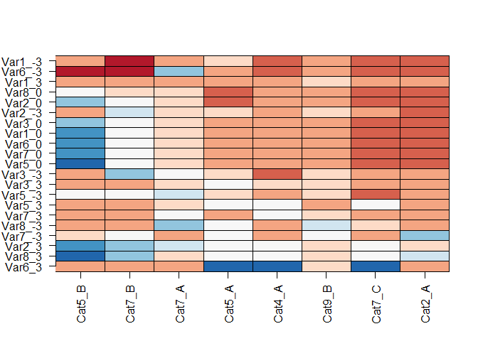

Primary Component Analysis (PCA)
--------------------------------

Based on the evidence that some combinations of categorical and numerical vehicle characteristics may have an effect on the ability to predict losses, the data is prepared for a primary component analysis. This would result in the linear combinations of the combinations of categorical and numerical vehicle characteristics that have the greatest differences between vehicles with claims and ones without. Plotting the points for each vehicle in the plane of the first two primary components provides a method to visualize regions in the plot where claims are more likely than not.

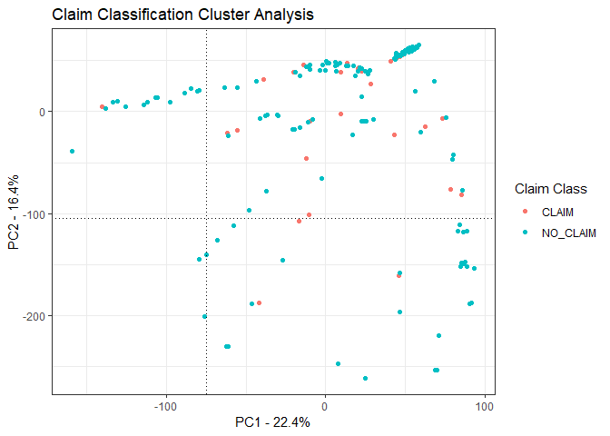

Determining the best cutoff values for PCA based prediction
===========================================================

By inspecting the above plot, one can identify a specific region where claims are more likely. In order to find the best prediction, different cutoff values are used to predict and test the accuracy of the predictions.

| Method                        |  Sensitivity|  Specificity|  Balanced\_Accuracy|         F1|
|:------------------------------|------------:|------------:|-------------------:|----------:|
| PC1 &gt; -125 , PC2 &gt; -115 |    0.5098039|    0.4866821|           0.4982430|  0.0100309|
| PC1 &gt; -125 , PC2 &gt; -110 |    0.5098039|    0.4866821|           0.4982430|  0.0100309|
| PC1 &gt; -125 , PC2 &gt; -105 |    0.5098039|    0.4866821|           0.4982430|  0.0100309|
| PC1 &gt; -125 , PC2 &gt; -100 |    0.5098039|    0.4888934|           0.4993486|  0.0100736|
| PC1 &gt; -125 , PC2 &gt; -95  |    0.5098039|    0.4906021|           0.5002030|  0.0101069|
| PC1 &gt; -125 , PC2 &gt; -90  |    0.5098039|    0.4908031|           0.5003035|  0.0101108|
| PC1 &gt; -125 , PC2 &gt; -85  |    0.5098039|    0.4908031|           0.5003035|  0.0101108|
| PC1 &gt; -125 , PC2 &gt; -80  |    0.5098039|    0.4909036|           0.5003538|  0.0101128|
| PC1 &gt; -125 , PC2 &gt; -75  |    0.5098039|    0.4930144|           0.5014091|  0.0101543|
| PC1 &gt; -115 , PC2 &gt; -110 |    0.5098039|    0.4870841|           0.4984440|  0.0100386|
| PC1 &gt; -115 , PC2 &gt; -105 |    0.5098039|    0.4870841|           0.4984440|  0.0100386|
| PC1 &gt; -115 , PC2 &gt; -100 |    0.5098039|    0.4892954|           0.4995497|  0.0100814|
| PC1 &gt; -115 , PC2 &gt; -95  |    0.5098039|    0.4910041|           0.5004040|  0.0101148|
| PC1 &gt; -115 , PC2 &gt; -90  |    0.5098039|    0.4912051|           0.5005045|  0.0101187|
| PC1 &gt; -115 , PC2 &gt; -85  |    0.5098039|    0.4912051|           0.5005045|  0.0101187|
| PC1 &gt; -115 , PC2 &gt; -80  |    0.5098039|    0.4913057|           0.5005548|  0.0101207|
| PC1 &gt; -115 , PC2 &gt; -75  |    0.5098039|    0.4934164|           0.5016102|  0.0101622|
| PC1 &gt; -110 , PC2 &gt; -105 |    0.5098039|    0.4870841|           0.4984440|  0.0100386|
| PC1 &gt; -110 , PC2 &gt; -100 |    0.5098039|    0.4892954|           0.4995497|  0.0100814|
| PC1 &gt; -110 , PC2 &gt; -95  |    0.5098039|    0.4910041|           0.5004040|  0.0101148|
| PC1 &gt; -110 , PC2 &gt; -90  |    0.5098039|    0.4912051|           0.5005045|  0.0101187|
| PC1 &gt; -110 , PC2 &gt; -85  |    0.5098039|    0.4912051|           0.5005045|  0.0101187|
| PC1 &gt; -110 , PC2 &gt; -80  |    0.5098039|    0.4913057|           0.5005548|  0.0101207|
| PC1 &gt; -110 , PC2 &gt; -75  |    0.5098039|    0.4934164|           0.5016102|  0.0101622|
| PC1 &gt; -105 , PC2 &gt; -100 |    0.5098039|    0.4911046|           0.5004543|  0.0101167|
| PC1 &gt; -105 , PC2 &gt; -95  |    0.5098039|    0.4928133|           0.5013086|  0.0101503|
| PC1 &gt; -105 , PC2 &gt; -90  |    0.5098039|    0.4930144|           0.5014091|  0.0101543|
| PC1 &gt; -105 , PC2 &gt; -85  |    0.5098039|    0.4930144|           0.5014091|  0.0101543|
| PC1 &gt; -105 , PC2 &gt; -80  |    0.5098039|    0.4930144|           0.5014091|  0.0101543|
| PC1 &gt; -105 , PC2 &gt; -75  |    0.5098039|    0.4942205|           0.5020122|  0.0101781|
| PC1 &gt; -100 , PC2 &gt; -95  |    0.5098039|    0.4934164|           0.5016102|  0.0101622|
| PC1 &gt; -100 , PC2 &gt; -90  |    0.5098039|    0.4936174|           0.5017107|  0.0101662|
| PC1 &gt; -100 , PC2 &gt; -85  |    0.5098039|    0.4936174|           0.5017107|  0.0101662|
| PC1 &gt; -100 , PC2 &gt; -80  |    0.5098039|    0.4936174|           0.5017107|  0.0101662|
| PC1 &gt; -100 , PC2 &gt; -75  |    0.5098039|    0.4948236|           0.5023138|  0.0101901|
| PC1 &gt; -95 , PC2 &gt; -90   |    0.5098039|    0.4936174|           0.5017107|  0.0101662|
| PC1 &gt; -95 , PC2 &gt; -85   |    0.5098039|    0.4936174|           0.5017107|  0.0101662|
| PC1 &gt; -95 , PC2 &gt; -80   |    0.5098039|    0.4936174|           0.5017107|  0.0101662|
| PC1 &gt; -95 , PC2 &gt; -75   |    0.5098039|    0.4948236|           0.5023138|  0.0101901|
| PC1 &gt; -90 , PC2 &gt; -85   |    0.5098039|    0.4939190|           0.5018615|  0.0101721|
| PC1 &gt; -90 , PC2 &gt; -80   |    0.5098039|    0.4939190|           0.5018615|  0.0101721|
| PC1 &gt; -90 , PC2 &gt; -75   |    0.5098039|    0.4951251|           0.5024645|  0.0101961|
| PC1 &gt; -85 , PC2 &gt; -80   |    0.5098039|    0.4946226|           0.5022132|  0.0101861|
| PC1 &gt; -85 , PC2 &gt; -75   |    0.5098039|    0.4958287|           0.5028163|  0.0102101|
| PC1 &gt; -80 , PC2 &gt; -75   |    0.5098039|    0.5011559|           0.5054799|  0.0103175|

Logistic Regression Analysis
----------------------------

To compare the predictions of the primary component analysis, a logistic regression model is computed using the categorical and numeric vehicle characteristics of interest. Several different cutoff values for probability are used to in order to select the cutoff that will result in the best prediction.

| Method                                   |  Sensitivity|  Specificity|  Balanced\_Accuracy|         F1|
|:-----------------------------------------|------------:|------------:|-------------------:|----------:|
| LOGISTIC REGRESSION - cutoff -&gt; 0.98  |    0.0145110|    0.9906342|           0.5025726|  0.0125136|
| LOGISTIC REGRESSION - cutoff -&gt; 0.981 |    0.0151420|    0.9903534|           0.5027477|  0.0128377|
| LOGISTIC REGRESSION - cutoff -&gt; 0.982 |    0.0157729|    0.9893842|           0.5025785|  0.0126454|
| LOGISTIC REGRESSION - cutoff -&gt; 0.983 |    0.0176656|    0.9883471|           0.5030063|  0.0133779|
| LOGISTIC REGRESSION - cutoff -&gt; 0.984 |    0.0189274|    0.9875681|           0.5032478|  0.0137615|
| LOGISTIC REGRESSION - cutoff -&gt; 0.985 |    0.0208202|    0.9848689|           0.5028445|  0.0133091|
| LOGISTIC REGRESSION - cutoff -&gt; 0.986 |    0.0227129|    0.9810827|           0.5018978|  0.0124181|
| LOGISTIC REGRESSION - cutoff -&gt; 0.987 |    0.0290221|    0.9768708|           0.5029464|  0.0136539|
| LOGISTIC REGRESSION - cutoff -&gt; 0.988 |    0.0359621|    0.9667079|           0.5013350|  0.0126765|
| LOGISTIC REGRESSION - cutoff -&gt; 0.989 |    0.0473186|    0.9535966|           0.5004576|  0.0125987|
| LOGISTIC REGRESSION - cutoff -&gt; 0.99  |    0.0687697|    0.9338007|           0.5012852|  0.0133652|
| LOGISTIC REGRESSION - cutoff -&gt; 0.991 |    0.1072555|    0.8951464|           0.5012009|  0.0136508|
| LOGISTIC REGRESSION - cutoff -&gt; 0.992 |    0.1892744|    0.8320449|           0.5106597|  0.0153965|
| LOGISTIC REGRESSION - cutoff -&gt; 0.993 |    0.2662461|    0.7582868|           0.5122664|  0.0152407|
| LOGISTIC REGRESSION - cutoff -&gt; 0.994 |    0.3665615|    0.6605345|           0.5135480|  0.0150672|
| LOGISTIC REGRESSION - cutoff -&gt; 0.995 |    0.4473186|    0.5928724|           0.5200955|  0.0153814|
| LOGISTIC REGRESSION - cutoff -&gt; 0.996 |    0.5728707|    0.4673397|           0.5201052|  0.0151200|
| LOGISTIC REGRESSION - cutoff -&gt; 0.997 |    0.7305994|    0.3087186|           0.5196590|  0.0149054|
| LOGISTIC REGRESSION - cutoff -&gt; 0.998 |    0.8410095|    0.1921124|           0.5165609|  0.0147047|
| LOGISTIC REGRESSION - cutoff -&gt; 0.999 |    0.8990536|    0.1297039|           0.5143787|  0.0146024|
| LOGISTIC REGRESSION - cutoff -&gt; 1     |    1.0000000|    0.0000000|           0.5000000|  0.0141535|

Validation
----------

The cutoffs obtained above is the used against the test data set to obtain an unbiased result

| Method                                       |  Sensitivity|  Specificity|  Balanced\_Accuracy|         F1|
|:---------------------------------------------|------------:|------------:|-------------------:|----------:|
| Best PCA result: PC1 &gt; -90 , PC2 &gt; -75 |       0.5125|    0.4960685|           0.5042843|  0.0160156|

| Method                                       |  Sensitivity|  Specificity|  Balanced\_Accuracy|         F1|
|:---------------------------------------------|------------:|------------:|-------------------:|----------:|
| Best logistic regression result at p = 0.996 |       0.4875|    0.4639113|           0.4757056|  0.0143461|

Comparison of PCA prediction results with Logistic Regression results
---------------------------------------------------------------------

The results from the best pca prediction result and the best logistic regression result showed that, the pca approach was more sensitive in predicting claims, while the logistic regression approach had high specificity in its results. The pca approach had an advantage in that it could isolate vehicles with claims to a specific region the first two primary component plane. This is advantageous because ensemble methods can be used to boost the sensitivity in a visual manner.

It also enables us to visualize areas in which prediction results were different for each method.

The following plot shows which vehicles were predicted the same by both the pca and the logistic regression method. It shows that there were many incorrect claim predictions in the region that pca predicted as claim regardless of the method used. It also shows that there were not too many "no claim" predictions outside of the pca prediction region, validating the strengths of the pca approach.

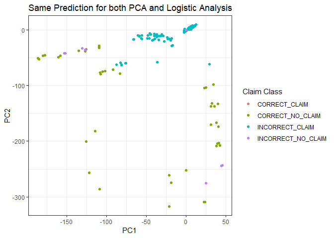

The next plot shows how predictions appear on the primary component plane. It shows once again a very low count of incorrectly predicted "no claim" instances.

    ## Joining, by = "Row_ID"
    ## Joining, by = "Row_ID"

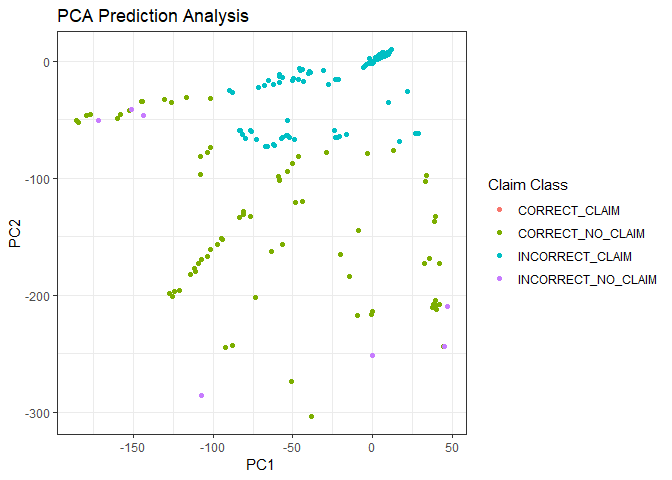

The next plot analyzes the logistic regression results on the primary component plane. In this plot, it can be seen that there were many incorrectly predicted claims outside of the region where the other "pca" approach predicted "claim".

    ## Joining, by = "Row_ID"
    ## Joining, by = "Row_ID"

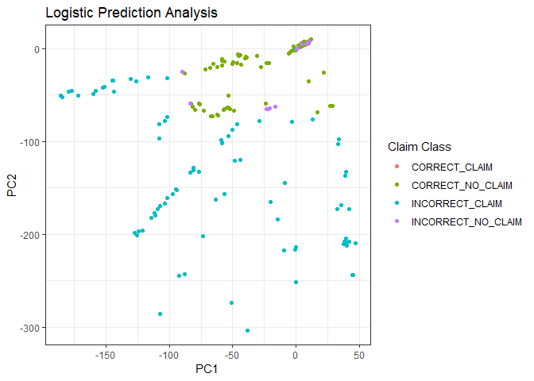

The number of actual claims are very small (less than 1%) compared to the number of vehicles insured. It can be seen in this plot how the pca method was able to predict actual claims better in a methodical manner.

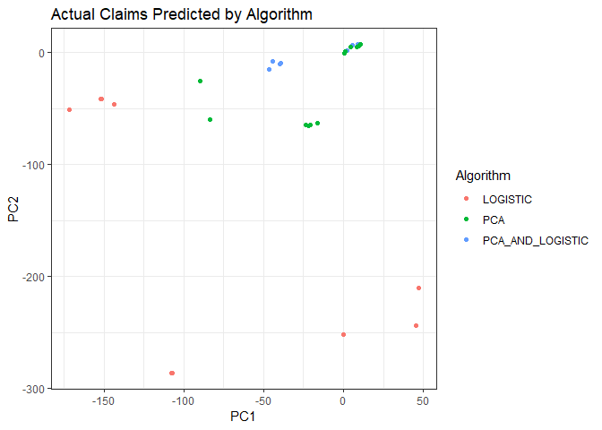

The actual number of "no claims" were very high. The following plot compares the two prediction methods in how successful they were in correctly predicting instances of "no claims". It shows the pca method correclty predicted many more "no claim" instances outside its "claim" prediction region.

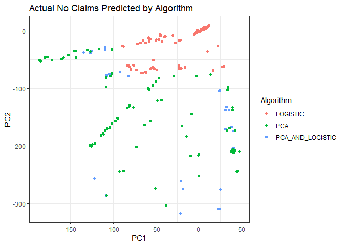

The logistic regression method incorrectly predicted a few vehicles as "no claim" inside the pca "claim" region, while there were not as many of them by the pca method.

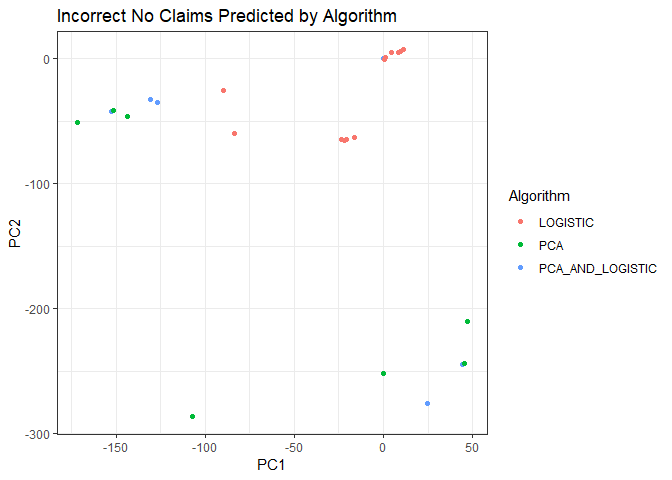

The incorrect "claim" predictions for both methods appeared in different regions within the pca plot.

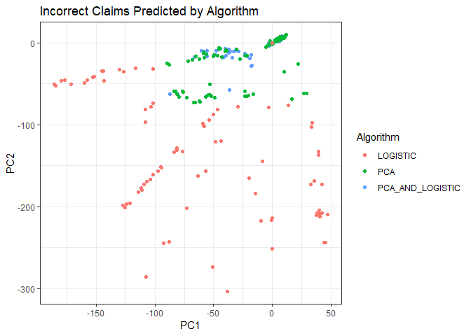

Past claim impact on current year claims
----------------------------------------

Households that did not have any claims in 2005 is analyzed for how they fared in 2006. The summary shows that these households had vehicles with claims in the following year. However, the same households also had a larger number of vehicles without any claims in the following year.

A chi-square test suggests that this is not due random variation but a statistically significant result by its low p-value. It suggests that households who did not have a claim in the previous year would be far more unlikely to have a claim in the following year that the current year, justifying a safe driver discount.

    ## Joining, by = "Household_ID"
    ## Joining, by = "Household_ID"

|          |     2005|     2006|
|----------|--------:|--------:|
| Claim    |        0|    24904|
| No Claim |  2532143|  3159868|

    ## 
    ##  Pearson's Chi-squared test with Yates' continuity correction
    ## 
    ## data:  chi_square_data_2005_2006_for_2005_no_claims
    ## X-squared = 19885, df = 1, p-value < 2.2e-16

Households with claims in 2005 were analyzed for how they came up in 2006 in terms of claims, and here although the lower p-value in the chi-square test suggests the result is not due to random variability, it also shows that there were much more "no claim" vehicles in 2006 that what was expected from 2005 results suggesting that "accident forgiveness" is justified.

    ## Joining, by = "Household_ID"
    ## Joining, by = "Household_ID"
    ## Joining, by = "Household_ID"

|          |   2005|   2006|
|----------|------:|------:|
| Claim    |  30148|  31690|
| No Claim |  33212|  45126|

    ## 
    ##  Pearson's Chi-squared test with Yates' continuity correction
    ## 
    ## data:  chi_square_data_2005_2006_for_2005_claims
    ## X-squared = 563.64, df = 1, p-value < 2.2e-16

Visual examination of the vehicles with claims for households with no claims in the prior year shows that there are few such instances.

    ## Joining, by = "Household_ID"

    ## Joining, by = "Row_ID"

    ## Joining, by = "Household_ID"

    ## Joining, by = "Row_ID"

    ## Joining, by = "Household_ID"

    ## Joining, by = "Row_ID"

    ## Joining, by = "Household_ID"

    ## Joining, by = "Row_ID"

    ## Joining, by = c("Row_ID", "Category", "PC1", "PC2")

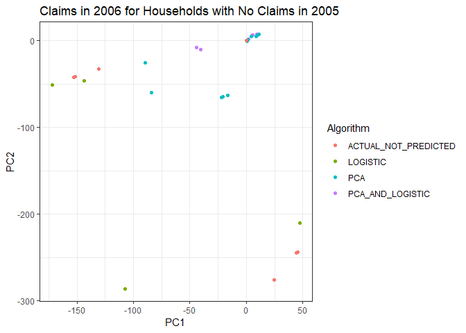

On the other hand, the number of "no claim" instances for households with no claims in the prior year was very large and many of those cases were not predicted by either the pca method or the logistic regression method.

    ## Joining, by = "Household_ID"

    ## Joining, by = "Row_ID"

    ## Joining, by = "Household_ID"

    ## Joining, by = "Row_ID"

    ## Joining, by = "Household_ID"

    ## Joining, by = "Row_ID"

    ## Joining, by = "Household_ID"

    ## Joining, by = "Row_ID"

    ## Joining, by = c("Row_ID", "Category", "PC1", "PC2")

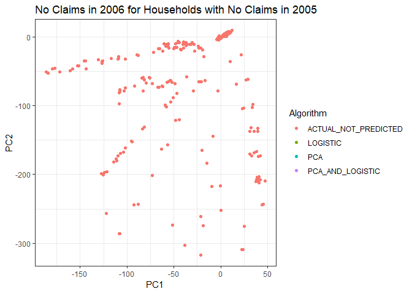

Therefore there is an opportunity to improve apon the pca prediction result by predicting vehicles whose households did not have a claim in the past year as not likely to have claim in the current year.

    ## Joining, by = "Row_ID"

| Method                                                 |  Sensitivity|  Specificity|  Balanced\_Accuracy|         F1|
|:-------------------------------------------------------|------------:|------------:|-------------------:|----------:|
| PCA best prediction with past year no claim correction |       0.5125|    0.9131048|           0.7128024|  0.0834181|

Also as was seen earlier, logistic regression method predicted claims in regions where the pca method did not predict claims in the pca prediction plane. Since these two regions are mutually exclusive, adding logistic regression positive claim predictions in regions where the pca method did not have any would boost the overall accuracy of the predictions.

    ## Joining, by = "Row_ID"
    ## Joining, by = "Row_ID"
    ## Joining, by = "Row_ID"
    ## Joining, by = "Row_ID"

| Method                                   |  Sensitivity|  Specificity|  Balanced\_Accuracy|         F1|
|:-----------------------------------------|------------:|------------:|-------------------:|----------:|
| PCA best prediction with logistic\_boost |         0.85|    0.1496976|           0.4998488|  0.0158453|

Finally, it is logical to add both the past year no claim boost and the logistic regression boost to the pca method results to achieve the best accuracy prediction results.

    ## Joining, by = "Row_ID"

| Method                                                 |  Sensitivity|  Specificity|  Balanced\_Accuracy|         F1|
|:-------------------------------------------------------|------------:|------------:|-------------------:|----------:|
| PCA, logistic boost with past year no claim prediction |         0.85|    0.8454637|           0.8477319|  0.0809042|

Conclusion
----------

Insured vehicle and claim data for 2005 and 2006 was examined. Each year had about 4 million vehicles insured of which 30,000 of them produced claims. Exploration of categorical and numerical vehicle characteristics was analysed for patterns which could be indentified as increasing the probability of a vehicle having a claim. Primary component analysis was then conducted on combinations of categorical and numerical verhicle characteristics based those observerations. The resulting predictions was found to have interesting properties that would yield itself well to be used in an ensemble due to a visible region in a plane where the predictions are made. The results were compared with Logistic Regression which had higher specificity than the (primary component analysis) pca method, but a lower sensitivity. By combining the results from pca method in regions where the pca does not predict claim helps the sensitivity of the predictions.

The impact of past claims was analyzed and it was found that households with claims in the prior year did not adversely affect the ability of a household to stay claim free. In fact the odds were higher that such households would have fewer claims in the next year, justifying the popular "accident forgiveness" policy. It was also discovered that households that were claim free in one year were very likely to be claim free in the next justifying the popular "claim free discounts".

Combining the last finding regarding claim free households with the pca analysis and the logistic results, an ensembled prediction produced both high sensitivity and specificity.

Since keeping insurance costs down relies on the ability to predict differnt classes of loss amounts, next steps would be to predict which vehicles would incur low, medium and high claim amounts. The data sets contain loss amounts in each year which can be used to predict such classes.

Appendix A
----------

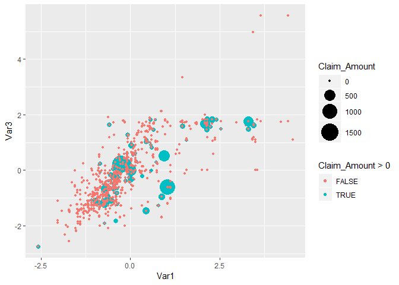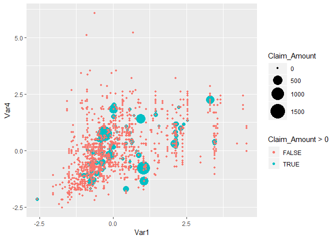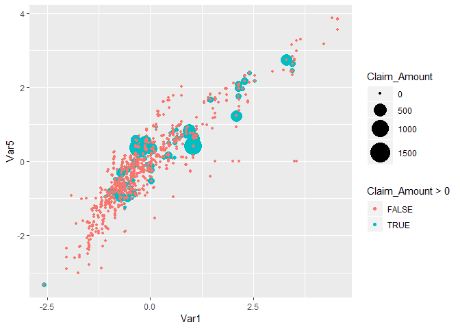

    ## [[1]]

    ## 
    ## [[2]]

    ## 
    ## [[3]]

    ## 
    ## [[4]]

Appendix B
----------

    ## 
    ## Call:
    ## glm(formula = Amount_Category ~ Cat1, family = "binomial", data = claim_data_2005[1:10000, 
    ##     ])
    ## 
    ## Deviance Residuals: 
    ##     Min       1Q   Median       3Q      Max  
    ## -3.2568   0.1345   0.1563   0.1574   0.2104  
    ## 
    ## Coefficients:
    ##             Estimate Std. Error z value Pr(>|z|)
    ## (Intercept)    16.57     379.40   0.044    0.965
    ## Cat1A         -12.77     379.40  -0.034    0.973
    ## Cat1B         -12.18     379.40  -0.032    0.974
    ## Cat1C         -11.61     379.40  -0.031    0.976
    ## Cat1D         -12.17     379.40  -0.032    0.974
    ## Cat1E         -11.79     379.40  -0.031    0.975
    ## Cat1F         -12.01     379.40  -0.032    0.975
    ## Cat1G         -11.62     379.40  -0.031    0.976
    ## Cat1H         -12.30     379.40  -0.032    0.974
    ## Cat1I         -11.87     379.40  -0.031    0.975
    ## Cat1J         -11.27     379.40  -0.030    0.976
    ## 
    ## (Dispersion parameter for binomial family taken to be 1)
    ## 
    ##     Null deviance: 1228.9  on 9999  degrees of freedom
    ## Residual deviance: 1219.4  on 9989  degrees of freedom
    ## AIC: 1241.4
    ## 
    ## Number of Fisher Scoring iterations: 15

    ## 
    ## Call:
    ## glm(formula = Amount_Category ~ Cat2, family = "binomial", data = claim_data_2005[1:10000, 
    ##     ])
    ## 
    ## Deviance Residuals: 
    ##     Min       1Q   Median       3Q      Max  
    ## -3.0393   0.1408   0.1441   0.1551   0.2571  
    ## 
    ## Coefficients:
    ##             Estimate Std. Error z value Pr(>|z|)    
    ## (Intercept)  4.60888    0.16987  27.132   <2e-16 ***
    ## Cat2A       -0.04637    0.29714  -0.156   0.8760    
    ## Cat2B       -1.21605    0.53597  -2.269   0.0233 *  
    ## Cat2C       -0.19457    0.21663  -0.898   0.3691    
    ## ---
    ## Signif. codes:  0 '***' 0.001 '**' 0.01 '*' 0.05 '.' 0.1 ' ' 1
    ## 
    ## (Dispersion parameter for binomial family taken to be 1)
    ## 
    ##     Null deviance: 1228.9  on 9999  degrees of freedom
    ## Residual deviance: 1224.6  on 9996  degrees of freedom
    ## AIC: 1232.6
    ## 
    ## Number of Fisher Scoring iterations: 7

    ## 
    ## Call:
    ## glm(formula = Amount_Category ~ Cat4, family = "binomial", data = claim_data_2005[1:10000, 
    ##     ])
    ## 
    ## Deviance Residuals: 
    ##     Min       1Q   Median       3Q      Max  
    ## -3.0199   0.1450   0.1450   0.1586   0.1685  
    ## 
    ## Coefficients:
    ##             Estimate Std. Error z value Pr(>|z|)    
    ## (Intercept)   4.5494     0.1343  33.866   <2e-16 ***
    ## Cat4A        -0.1802     0.2053  -0.878    0.380    
    ## Cat4B        14.0167   379.1207   0.037    0.971    
    ## Cat4C        -0.3019     0.3008  -1.004    0.316    
    ## ---
    ## Signif. codes:  0 '***' 0.001 '**' 0.01 '*' 0.05 '.' 0.1 ' ' 1
    ## 
    ## (Dispersion parameter for binomial family taken to be 1)
    ## 
    ##     Null deviance: 1228.9  on 9999  degrees of freedom
    ## Residual deviance: 1220.8  on 9996  degrees of freedom
    ## AIC: 1228.8
    ## 
    ## Number of Fisher Scoring iterations: 17

    ## 
    ## Call:
    ## glm(formula = Amount_Category ~ Cat5, family = "binomial", data = claim_data_2005[1:10000, 
    ##     ])
    ## 
    ## Deviance Residuals: 
    ##     Min       1Q   Median       3Q      Max  
    ## -3.1460   0.1450   0.1450   0.1604   0.1604  
    ## 
    ## Coefficients:
    ##             Estimate Std. Error z value Pr(>|z|)    
    ## (Intercept)   4.5505     0.1343  33.874   <2e-16 ***
    ## Cat5A        -0.2037     0.1928  -1.057    0.291    
    ## Cat5B        13.0156   463.0359   0.028    0.978    
    ## Cat5C         0.3912     0.5948   0.658    0.511    
    ## ---
    ## Signif. codes:  0 '***' 0.001 '**' 0.01 '*' 0.05 '.' 0.1 ' ' 1
    ## 
    ## (Dispersion parameter for binomial family taken to be 1)
    ## 
    ##     Null deviance: 1228.9  on 9999  degrees of freedom
    ## Residual deviance: 1225.4  on 9996  degrees of freedom
    ## AIC: 1233.4
    ## 
    ## Number of Fisher Scoring iterations: 16

    ## 
    ## Call:
    ## glm(formula = Amount_Category ~ Cat6, family = "binomial", data = claim_data_2005[1:10000, 
    ##     ])
    ## 
    ## Deviance Residuals: 
    ##     Min       1Q   Median       3Q      Max  
    ## -3.3133   0.1428   0.1581   0.1581   0.1617  
    ## 
    ## Coefficients:
    ##             Estimate Std. Error z value Pr(>|z|)
    ## (Intercept)    16.57     379.40   0.044    0.965
    ## Cat6B         -11.99     379.40  -0.032    0.975
    ## Cat6C         -12.24     379.40  -0.032    0.974
    ## Cat6D         -12.19     379.40  -0.032    0.974
    ## Cat6E         -11.85     379.40  -0.031    0.975
    ## Cat6F         -11.08     379.40  -0.029    0.977
    ## 
    ## (Dispersion parameter for binomial family taken to be 1)
    ## 
    ##     Null deviance: 1228.9  on 9999  degrees of freedom
    ## Residual deviance: 1224.6  on 9994  degrees of freedom
    ## AIC: 1236.6
    ## 
    ## Number of Fisher Scoring iterations: 15

    ## 
    ## Call:
    ## glm(formula = Amount_Category ~ Cat7, family = "binomial", data = claim_data_2005[1:10000, 
    ##     ])
    ## 
    ## Deviance Residuals: 
    ##     Min       1Q   Median       3Q      Max  
    ## -3.1345   0.1459   0.1459   0.1646   0.1646  
    ## 
    ## Coefficients:
    ##             Estimate Std. Error z value Pr(>|z|)    
    ## (Intercept)   4.5373     0.1219  37.217   <2e-16 ***
    ## Cat7A         0.3679     0.5164   0.712    0.476    
    ## Cat7B        -0.2333     0.7222  -0.323    0.747    
    ## Cat7C        -0.2422     0.2038  -1.188    0.235    
    ## Cat7D        13.0287   515.0508   0.025    0.980    
    ## ---
    ## Signif. codes:  0 '***' 0.001 '**' 0.01 '*' 0.05 '.' 0.1 ' ' 1
    ## 
    ## (Dispersion parameter for binomial family taken to be 1)
    ## 
    ##     Null deviance: 1228.9  on 9999  degrees of freedom
    ## Residual deviance: 1225.3  on 9995  degrees of freedom
    ## AIC: 1235.3
    ## 
    ## Number of Fisher Scoring iterations: 16

    ## 
    ## Call:
    ## glm(formula = Amount_Category ~ Cat8, family = "binomial", data = claim_data_2005[1:10000, 
    ##     ])
    ## 
    ## Deviance Residuals: 
    ##     Min       1Q   Median       3Q      Max  
    ## -3.0778   0.1327   0.1552   0.1552   0.1665  
    ## 
    ## Coefficients:
    ##             Estimate Std. Error z value Pr(>|z|)
    ## (Intercept)   13.566    378.593   0.036    0.971
    ## Cat8A         -9.153    378.593  -0.024    0.981
    ## Cat8B         -8.838    378.593  -0.023    0.981
    ## Cat8C         -9.295    378.593  -0.025    0.980
    ## 
    ## (Dispersion parameter for binomial family taken to be 1)
    ## 
    ##     Null deviance: 1228.9  on 9999  degrees of freedom
    ## Residual deviance: 1226.6  on 9996  degrees of freedom
    ## AIC: 1234.6
    ## 
    ## Number of Fisher Scoring iterations: 12

    ## 
    ## Call:
    ## glm(formula = Amount_Category ~ Cat9, family = "binomial", data = claim_data_2005[1:10000, 
    ##     ])
    ## 
    ## Deviance Residuals: 
    ##     Min       1Q   Median       3Q      Max  
    ## -3.0222   0.1445   0.1445   0.1445   0.1798  
    ## 
    ## Coefficients:
    ##             Estimate Std. Error z value Pr(>|z|)    
    ## (Intercept)   4.1166     0.2102  19.583   <2e-16 ***
    ## Cat9B         0.4399     0.2357   1.867    0.062 .  
    ## ---
    ## Signif. codes:  0 '***' 0.001 '**' 0.01 '*' 0.05 '.' 0.1 ' ' 1
    ## 
    ## (Dispersion parameter for binomial family taken to be 1)
    ## 
    ##     Null deviance: 1228.9  on 9999  degrees of freedom
    ## Residual deviance: 1225.7  on 9998  degrees of freedom
    ## AIC: 1229.7
    ## 
    ## Number of Fisher Scoring iterations: 7

    ## 
    ## Call:
    ## glm(formula = Amount_Category ~ OrdCat, family = "binomial", 
    ##     data = claim_data_2005[1:10000, ])
    ## 
    ## Deviance Residuals: 
    ##     Min       1Q   Median       3Q      Max  
    ## -2.9977   0.1500   0.1501   0.1501   0.4854  
    ## 
    ## Coefficients:
    ##             Estimate Std. Error z value Pr(>|z|)  
    ## (Intercept)    2.079      1.061   1.961   0.0499 *
    ## OrdCat1       15.487   1978.090   0.008   0.9938  
    ## OrdCat2        2.402      1.078   2.229   0.0258 *
    ## OrdCat3       15.487    603.313   0.026   0.9795  
    ## OrdCat4        2.402      1.071   2.244   0.0249 *
    ## OrdCat5        2.401      1.074   2.236   0.0253 *
    ## OrdCat6       15.487    807.553   0.019   0.9847  
    ## OrdCat7       15.487   2797.442   0.006   0.9956  
    ## ---
    ## Signif. codes:  0 '***' 0.001 '**' 0.01 '*' 0.05 '.' 0.1 ' ' 1
    ## 
    ## (Dispersion parameter for binomial family taken to be 1)
    ## 
    ##     Null deviance: 1228.9  on 9999  degrees of freedom
    ## Residual deviance: 1224.4  on 9992  degrees of freedom
    ## AIC: 1240.4
    ## 
    ## Number of Fisher Scoring iterations: 16
